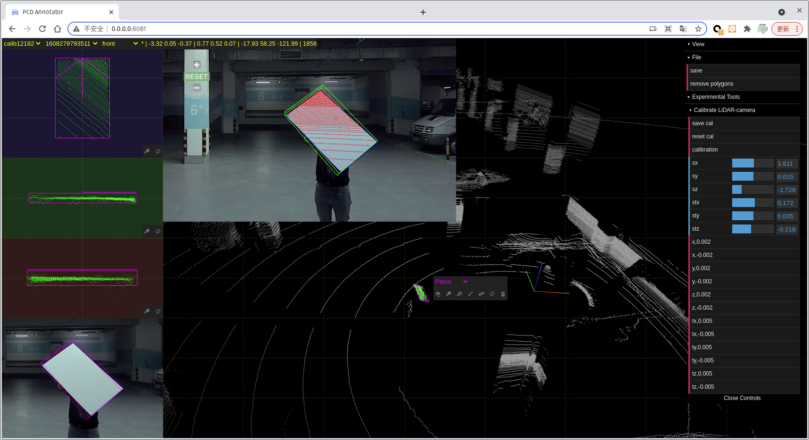

# ADD LIDAR CAM CALIB



## 操作说明

标定需要在图像上标注标定板边框，从左上角顺时针点4点

需要标注点云，箭头向上为标定板上方，第一个小窗口为标定板平面

删除图像框，点击file->remove polygons

标定点击calibration

结果在F12的console输出，点击save cal

# SUSTechPOINTS: Point Cloud 3D Bounding Box Annotation Tool


## News
2020.4.2  automatic yaw angle (z-axis) prediction.


## Note
This project is still under heavy development, some features/algorithms need packages which are not uploaded yet, we will upload them soon.

## Features

- 9 DoF box editing
- editing on perspective view and projective views
- multiple camera images as context, with auto-camera-switching
- camera-LiDAR fusion
- binary/ascii pcd files
- jpg/png image files
- semi-auto box annotation (need extra package)
- objects/boxes color by category
- focus mode to hide background to check details easily
- stream play/stop
- auto object tracking id generation
- interactive box fitting


## Requirements

python, cherrypy, tensorflow>=2.1

## Install
1. install packages
     ```
     pip install -r requirement.txt
     ```
1. download models 

     download pretrained model file [deep_annotation_inference.h5](https://github.com/naurril/SUSTechPOINTS/releases/download/0.1/deep_annotation_inference.h5), put it into `./algos/models`
     ```
     wget https://github.com/naurril/SUSTechPOINTS/releases/download/0.1/deep_annotation_inference.h5  -p algos/models
     ```

## Start
run the following script in shell, then go to http://127.0.0.1:8081
```
python main.py
```

## Data preparation

````
public
   +- data
       +- scene1
             +- image
                  +- front
                       +- 0000.jpg
                       +- 0001.jpg
                  +- left
                       +- ...
             +- pcd
                  +- 0000.pcd
                  +- 0001.pcd
             +- label
                  +- 0000.json
             +- calib
                  +- front.json
                  +- left.json
                  +- ...
       +- scene2
             
````

label is the directory to save the annotation result.

calib is the calibration matrix from point cloud to image. it's optional, but if provided, the box is projected on the image so as to assist the annotation.

check examples in `./data/example`

## Object type configuration

default object configuration is in [obj_cfg.js](src/public/js/../../../public/js/obj_cfg.js)

## Operations

You have 2 ways to add a new box:
  1) Right click on an object, choose object type in popup context menu
  2) Holding Ctrl, draw a rectangle enclosing the object.

Hint: 
  1) Adjust the main view so that the objects (e.g. cars) are heading upward or downward along the screen, use 'g' if the direction need to be reversed, use 'r' or 'f' to adjust the yaw angle (z-axis rotation)
  2) Adjust the main view so it's almost in bird's eye view. (direct bird's eye view support is not complete yet)


```
Main View:
     mouse scroll up/down:  zoom in/out
     mouse left key hold/move: rotate (change main view)
     mouse right key hold/move: pan

     left click on a box: select
     left click on a selected box: show transform control
     left click on non-box area: hide transform control if present, or unselect box

     Ctrl+mouse drag: add a new box

     -/=: adjust point size

     When transform control is enabled:
          v: switch transform modes among resize/translate/rotate
          z/x/c: turan on/off x/y/z axis
          use mouse to adjust the box.

     ctrl+s  save current frame
     del/ctrl+d  remove selected box

     1,2  select previous/next box
     3,4  show previous/next frame in current scene
     5,6,7  show camera helper box of sideviews.

     space: pause/continue stream play

Side sbu-view (projective view):

     (note: in perspective view, all keyboard operations are same as operating in top-view)

     a: move box left
     s: move box down
     d: move box right
     w: move box up
     q: rotate box counterclockwise
     e: rotate box clockwise
     r: rotate box counterclockwise, with box auto-fitting
     f: rotate box clockwise, with box auto-fitting
     g: reverse heading direction (rotate by PI)
     t: reset box

     double click on center: auto-shrink box by adjusting all borders to nearest innner point.
     double click on border: auto-shrink box by adjusting the border to nearest innner point.
     double click on corner: auto-shrink box by adjusting the corresponding borders to nearest innner point.

     drag border/corner/center: move border/corner/box.
     ctrl + drag border/corner: move border/corner/box with box auto-fitting


```

## Other Doc
[Deploy uwsgi](./doc/deploy_server.md)
